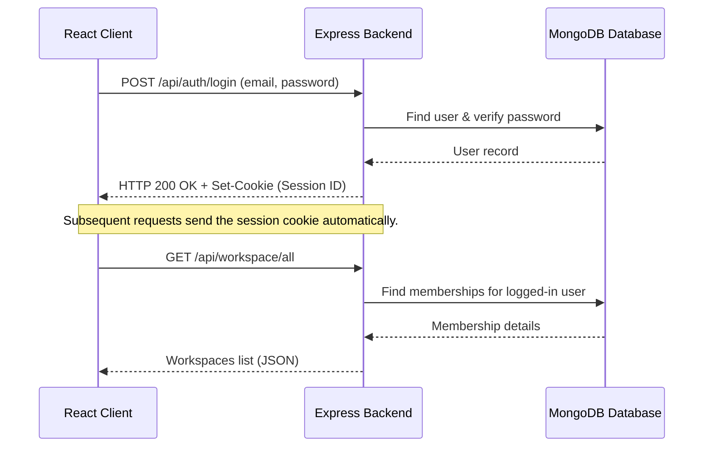

# Multi-Tenant Project Management SaaS Application Documentation

Welcome to the documentation for the Multi-Tenant Project Management SaaS Platform! This document provides an overview of the system's architecture, problem statement, core features, and technical details on how the React frontend and Express/MongoDB backend interact.

---

## 1. Introduction

The **Multi-Tenant Project Management SaaS** is a modern, responsive, and collaborative platform designed for teams to organize projects, track tasks, and collaborate securely. The system is multi-tenant, meaning it isolates data per **Workspace**, and employs a robust **Role-Based Access Control (RBAC)** model to enforce permission policies for different workspace members.

---

## 2. Problem Statement

Collaborative projects suffer from poor visibility and authorization leakages if they do not enforce structural limitations:
- **No Isolation**: Without workspace tenants, sensitive company or team data can leak between departments or guest accounts.
- **Unauthorized Task Delegation**: In typical platforms, standard members can create tasks and assign them to other team members without the owner's knowledge or consent. This breaks workload tracking, as members should focus on doing the job themselves, leaving delegator privileges to Workspace Owners or Admins.
- **Session Mismatch on Database Restart**: Standard development systems fail when local DBs restart, causing users to drop into inactive or undefined state paths because of stale cookies.

Our application addresses these by:
1. isolating data within dedicated Workspaces.
2. restricting task assignment: standard `MEMBER` roles are blocked in the backend and disabled in the frontend from assigning tasks to anyone other than themselves. Only `OWNER` and `ADMIN` roles have delegation powers.
3. maintaining a resilient auto-seeding engine that populates a default workspace, default project, and default task with pre-configured accounts on database startup.

---

## 3. Core Features

### Workspace Isolation (Multi-Tenancy)
- Users can create multiple workspaces.
- All projects, tasks, and member tables belong to a specific workspace and are isolated.
- Users are joined to workspaces via dynamic invite links/codes.

### Role-Based Access Control (RBAC)
The application defines three primary roles:
1. **OWNER**: Full administrative control over the workspace, projects, member roles, and task assignment.
2. **ADMIN**: Can edit workspace settings, manage projects, create tasks, and delegate them to anyone.
3. **MEMBER**: Can view workspace projects, view tasks, and edit tasks. Standard members are strictly limited to **assigning tasks to themselves** when creating tasks, and cannot change task assignees.

### Project & Task Management
- Workspaces contain projects characterized by names, emojis, and descriptions.
- Projects contain tasks featuring statuses (`BACKLOG`, `TODO`, `IN_PROGRESS`, `IN_REVIEW`, `DONE`), priorities (`LOW`, `MEDIUM`, `HIGH`), assignees, and due dates.
- Interactive tables with filtering and sorting support for efficient task management.

---

## 4. Technical Stack

### Frontend Architecture
- **Framework**: React 18.3.x with TypeScript for strict type checking.
- **Build Tool**: Vite 6.x.
- **Styling**: Tailwind CSS for design styling + Radix UI / Shadcn for accessible UI components (dialogs, select menus, dropdowns).
- **State Management**:
  - **Server State**: TanStack React Query (v5) for fetching, caching, and invalidating server-side data.
  - **Client State**: Zustand for simple and lightweight client-side state.
  - **Forms**: React Hook Form with Zod schema validation.

### Backend Architecture
- **Runtime**: Node.js with Express.js web framework.
- **Database**: MongoDB with Mongoose ODM (Object Document Mapper).
- **Session/Auth**: Passport.js with Local strategy and cookie-based sessions (`cookie-session`).
- **Input Validation**: Zod schemas for validating request bodies, parameters, and query strings.

---

## 5. Frontend-Backend Integration

The React frontend communicates with the Express backend using **Axios** as the HTTP client. The integration details are summarized below:



### Axios client Configuration (`client/src/lib/axios-client.ts`)
- **Base URL**: Dynamically configured via `import.meta.env.VITE_API_BASE_URL` (typically `http://localhost:8000/api` during local development).
- **Credentials**: Configured with `withCredentials: true` to ensure cookies (containing the session identifier) are automatically sent with every request.
- **Interceptors**: An interceptor intercepts responses. If a `401 Unauthorized` response is received, it automatically redirects the user back to the login screen `/`.

### React Query Hooks for Server State
Frontend API calls are encapsulated in TanStack Query hooks for cache management. For example, `useGetWorkspaceMembers` fetches the members of a workspace:

```typescript
const useGetWorkspaceMembers = (workspaceId: string) => {
  return useQuery({
    queryKey: ["members", workspaceId],
    queryFn: () => getWorkspaceMembersQueryFn(workspaceId),
    enabled: !!workspaceId,
  });
};
```
When a task is created or updated, `queryClient.invalidateQueries({ queryKey: ["all-tasks", workspaceId] })` triggers React Query to refetch tasks automatically, keeping the UI up to date without page reloads.

---

## 6. Directory Structure

```
project_management_saas/
├── backend/
│   └── src/
│       ├── config/          # MongoMemoryReplSet DB configuration and auto-seeders
│       ├── controllers/     # Route handlers (auth, workspaces, projects, tasks)
│       ├── models/          # Mongoose Schemas (User, Account, Workspace, Member, Project, Task)
│       ├── routes/          # Express route registration
│       ├── services/        # Business logic & Database queries
│       ├── utils/           # Authorization route guards and error handling utilities
│       └── validation/      # Input validation schemas (Zod)
└── client/
    └── src/
        ├── components/      # React views & sub-components
        ├── context/         # AuthProvider & WorkspaceProvider
        ├── hooks/           # custom react hooks and query wrappers
        ├── lib/             # Axios API client definition
        ├── page/            # Routable top-level components (Login, Dashboard, Projects, Tasks)
        └── types/           # TS definitions matching backend API payloads
```
